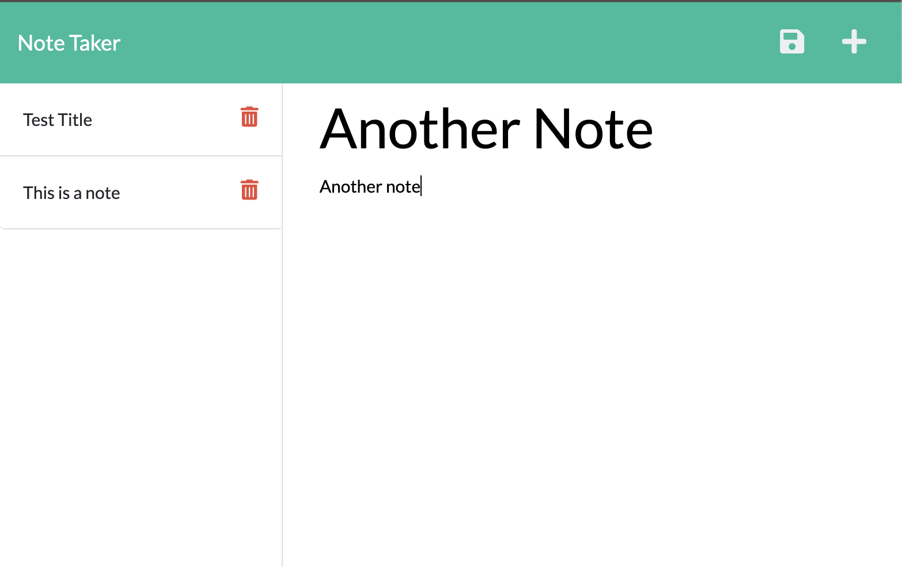

# The Ultiimate Note Taker

## Description

An express.js note taker app with the ability to add notes, delete notes, and save notes. 

## Usage

In your integrated terminal, run node server.js to launch the local host. Open local host: 3001 in your web browser to see and use the app. 

Click "Get Started"

To add a note, add a title and a description, click the save button. 

To delete a note, click on the note and click the trash can icon. 

## Credits

Emilee Bogdan  
GitHub: emileebogdan  
Email: emileebogdan@gmail.com  
 
Made with help from Scott Casey.
